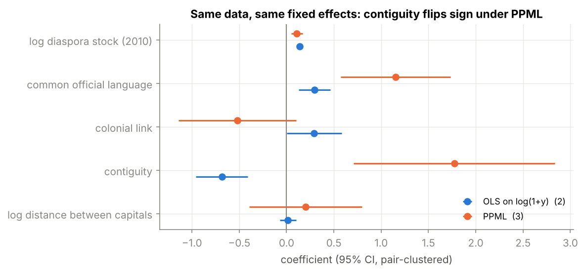
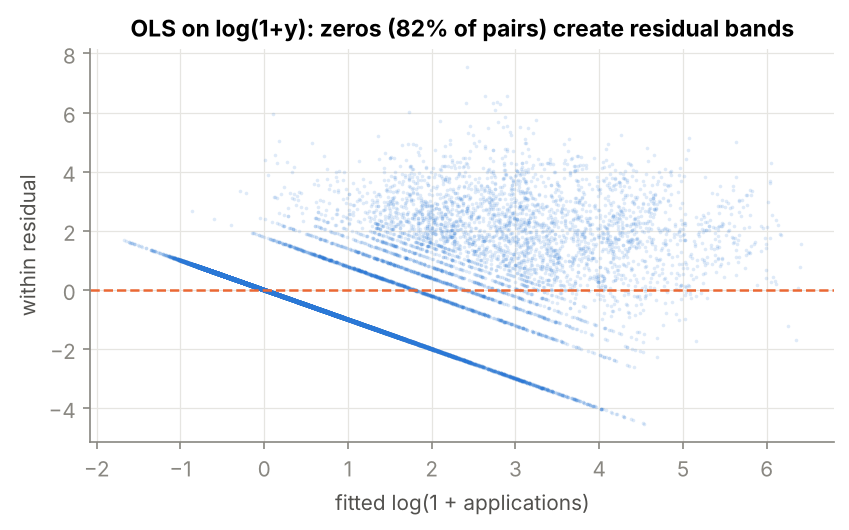
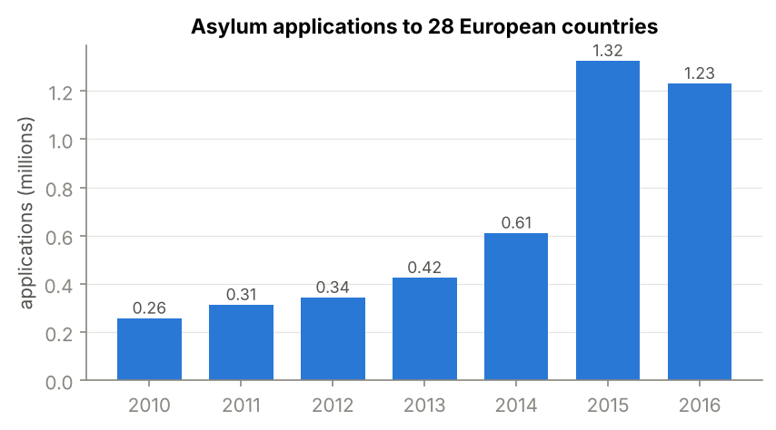

# Where do asylum seekers apply? A gravity model with high-dimensional fixed effects

[](https://github.com/selimaklibi/asylum-gravity/actions/workflows/tests.yml)
  

Panel econometrics on 39 200 origin × destination × year observations (200 origins, 28 European destinations, 2010–2016).
The project started as a third-year applied econometrics project at Université Paris-Saclay (report in French:
[`report/report_asylum_gravity_FR.pdf`](report/report_asylum_gravity_FR.pdf)). This repository re-implements the
estimators from scratch, replicates the report, and then stress-tests its specification.

**Main findings**

1. **Replication.** A from-scratch NumPy implementation of OLS and Poisson PML with three-way fixed effects and
   pair-clustered standard errors reproduces the report's `fixest` estimates exactly (coefficients, N = 26 824,
   adj. R² = 0.536).
2. **A data-coding error in the "political index".** The report averaged four indicators, but `fh_polity2_o` is
   coded in the opposite direction from the other three (its correlation with political rights is −0.96).
   Once the index is rebuilt with consistent orientation, its effect stays positive (0.43 on a 0–1 scale,
   p = 0.01). Because the panel is balanced, the index is orthogonal to the other regressors after fixed effects,
   so the other coefficients do not change.
3. **The headline "transit country" result is a functional-form artifact.** 82 % of pair-years are zeros, so OLS
   on log(1 + y) is inconsistent under heteroskedasticity (Santos Silva & Tenreyro, 2006). With PPML, contiguity
   goes from **−0.68 to +1.77** (p < 0.01). The common-language effect becomes four times larger, and destination
   GDP per capita becomes significant (elasticity 1.9).
4. **What is robust.** The diaspora elasticity is ≈ 0.10–0.14 in every specification, including structural gravity
   with origin × year and destination × year fixed effects, which absorb every origin- and destination-level shock.
   Distance never matters once networks are controlled for.

<p align="center"></p>

## Model

$$
\mathbb{E}[y_{jkt} \mid X] = \exp\left(\beta^\top X_{jkt} + \alpha_j + \gamma_k + \theta_t\right)
$$

for applications $y_{jkt}$ from origin $j$ to destination $k$ in year $t$. Regressors: log diaspora stock (2010,
so predetermined), log distance, common language, colonial link, contiguity, destination log GDP per capita and HDI,
and an origin repression index. The report estimated the log-linear version
$\log(1+y_{jkt}) = \beta^\top X_{jkt} + \alpha_j + \gamma_k + \theta_t + \varepsilon_{jkt}$ by OLS.

## Results

| | (1) OLS, report | (2) OLS, fixed index | (3) PPML | (4) PPML, 2010-15, no HDI | (5) PPML, structural |
|---|---|---|---|---|---|
| log diaspora stock (2010) | 0.139*** | 0.139*** | 0.109*** | 0.103*** | 0.099*** |
| | (0.011) | (0.011) | (0.031) | (0.028) | (0.025) |
| log distance between capitals | 0.015 | 0.015 | 0.204 | 0.302 | 0.127 |
| | (0.044) | (0.044) | (0.304) | (0.313) | (0.295) |
| common official language | 0.296*** | 0.296*** | 1.153*** | 1.437*** | 1.310*** |
| | (0.086) | (0.086) | (0.295) | (0.331) | (0.318) |
| colonial link | 0.292** | 0.292** | -0.521 | -0.625 | -0.538 |
| | (0.148) | (0.148) | (0.317) | (0.382) | (0.352) |
| contiguity | -0.684*** | -0.684*** | 1.773*** | 1.476** | 1.429** |
| | (0.140) | (0.140) | (0.542) | (0.605) | (0.586) |
| log GDP per capita (dest.) | 0.110 | 0.110 | 1.923** | 1.295 |  |
| | (0.099) | (0.099) | (0.820) | (0.939) |  |
| HDI (dest.) | 2.124 | 2.124 | 27.579* |  |  |
| | (2.135) | (2.136) | (14.133) |  |  |
| political index (original, report) | 0.188*** |  |  |  |  |
| | (0.045) |  |  |  |  |
| repression index (corrected) |  | 0.434** | 0.537 | 0.690 |  |
| |  | (0.173) | (0.414) | (0.793) |  |
| Fixed effects | origin, dest., year | origin, dest., year | origin, dest., year | origin, dest., year | origin×year, dest.×year |
| Observations | 26,824 | 26,824 | 19,264 | 23,800 | 23,352 |
| Pair clusters | 5,376 | 5,376 | 3,864 | 3,976 | 4,144 |
| Fit | adj. R² 0.536 | adj. R² 0.536 | pseudo-R² 0.517 | pseudo-R² 0.604 | pseudo-R² 0.877 |

Pair-clustered standard errors in parentheses. *** p<0.01, ** p<0.05, * p<0.10.

*Reading the table.* PPML coefficients are semi-elasticities of the expected number of applications: sharing an
official language multiplies expected applications by e^1.153 ≈ 3.2. Columns (1)–(3) cover 2010–2014 because HDI is
missing for 2015–16. Column (4) drops HDI to bring in 2015, the peak year of the crisis. PPML drops origins or
destinations whose flows are identically zero, since they carry no information on β. Column (5) is structural gravity:
origin × year and destination × year effects absorb multilateral resistance (Anderson & van Wincoop, 2003) and every
non-bilateral regressor.

<p align="center"> </p>

The residual bands (left) are the mass of zero flows. They show why a log-linear model of this panel is misspecified.

## Implementation

`hdfe/estimators.py` is a self-contained estimator, about 200 lines of NumPy:

* **Fixed effects** are partialled out by alternating projections (Frisch–Waugh–Lovell + Gauss–Seidel demeaning),
  so the dummy matrix (≈ 240 columns, or ≈ 1 600 for column 5) is never built.
* **PPML** is fitted by iteratively re-weighted least squares, with weighted demeaning at every iteration
  (Correia, Guimarães & Zylkin, 2020). Fixed-effect groups with all-zero outcomes are dropped iteratively.
* **Inference**: one-way cluster-robust sandwich, small-sample factor G/(G−1)·(N−1)/(N−K), where fixed effects
  nested in the clusters are not counted in K (as in `reghdfe`). It uses Student-t(G−1) p-values. Standard errors
  differ from the report's `fixest` output only at the third decimal, because the two packages count degrees of
  freedom differently.
* **Tests** (`tests/test_hdfe.py`, run in CI on simulated panels): demeaning equals the projection on dummies;
  FE-OLS and its clustered SEs equal brute-force dummy OLS; FE-PPML equals Newton–Raphson Poisson with dummies;
  PPML recovers the true β with many zeros, while log(1+y) OLS does not.

`R/gravity_fixest.R` runs the same five specifications with `fixest` (`feols` / `fepois` / `etable`) as a cross-check.

```
hdfe/                 FE-OLS and FE-PPML estimators
analysis/run_analysis.py   data prep, descriptive stats, 5 specifications, figures -> results/, figures/
R/gravity_fixest.R    same specifications in R/fixest
tests/                5 tests on simulated data (no proprietary data needed)
report/               original course report (French)
```

```bash
pip install -r requirements.txt
pytest -q
python analysis/run_analysis.py   # needs data/Asylum_data.csv, see data/README.md
```

## Limitations

* The diaspora stock is measured in 2010, so it is predetermined for 2011–2016 flows. It is still not exogenous:
  persistent pair-specific pull factors drive both the stock and the flows. An IV strategy or pair fixed effects
  (identified from time variation only) would be the next step.
* The repression index is identified only from within-origin changes over time, which are small (within s.d. 0.04)
  next to its cross-sectional variation.
* Recognition rates and destination asylum policies (`more_restrict_d`, `less_restrict_d`) are left for future work.

## References

- Anderson, J. & van Wincoop, E. (2003). Gravity with gravitas. *American Economic Review* 93(1).
- Santos Silva, J. & Tenreyro, S. (2006). The log of gravity. *Review of Economics and Statistics* 88(4).
- Correia, S., Guimarães, P. & Zylkin, T. (2020). Fast Poisson estimation with high-dimensional fixed effects. *Stata Journal* 20(1).
- Bergé, L. (2018). Efficient estimation of maximum likelihood models with multiple fixed-effects: the R package FENmlm. *CREA DP*.
- Hatton, T. (2004). Seeking asylum in Europe. *Economic Policy* 19(38).
- Beine, M., Docquier, F. & Özden, Ç. (2011). Diasporas. *Journal of Development Economics* 95(1).

## Authors

Astrid Carbelo, Mehdi Belhamiti, Selima Klibi (Université Paris-Saclay, 2026). Re-implementation and extensions: Selima Klibi.
